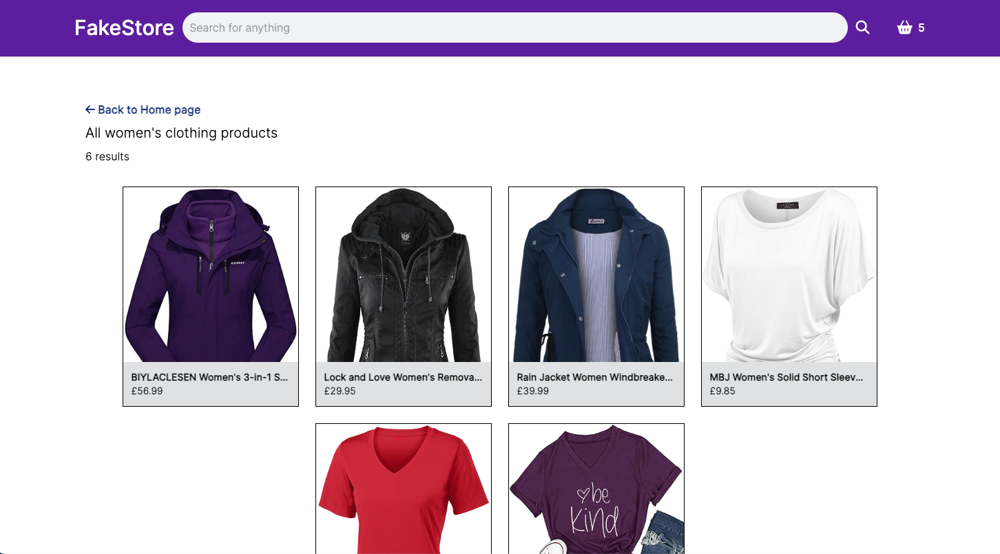

# Shopping cart

## [Live Demo](https://shopping-cart.netlify.app)

# Technologies Used

- Javascript
- React
- React router
- Context API
- FakeStoreAPI
- React testing library
- Vitest

Key learning:

## React testing library

After briefly using Jest to test my Battleship project, I had some basic knowledge of testing but this project was where I got to level up!

Testing React components is quite different from anything I had done before, most of all, thinking about what to test. One thing that helped was thinking about writing tests from the user’s perspective i.e how they interact with the app and what they see compared to testing internal functionalities such as if state has changed or if a function was called as this makes no difference to a user’s experience. Also checking for the presence of elements by using getByText was a helpful way to discern what the user was actually seeing.

This was definitely the hardest part for me and it took the longest to get right but it’s something I really want to get better at so I tried to make use of as many of the testing library's tools as I could to get more familiar with mocking API calls and functions!

## Client-side routing

A new concept that taught me a lot about SPA’s. It was interesting to think about the way components relate to one another as their relationship has now changed. Different ‘pages’ i.e components don't even need to know about one another. Instead of passing props like a parent/child relationship, potentially leading to props-drilling, they instead communicate through the useParams hook to agree on a URL structure and then render content based on that path.

## Context API

The usage of react-router led me to discover react’s Context API! To start with I had the basket provider wrapping the whole router provider and did not really understand how the context sharing worked so just wrapped it around the whole project because that worked. Throughout the project I thought what might happen if I had multiple contexts and if the placement was a good idea. I experimented with ways of sharing this context and settled on keeping the basket provider in the App component and wrapping the elements that needed it since they were all sitting there which felt like a slightly better option. 

## Tailwindcss

For this project, I decided to give Tailwind a go and it’s amazing! It doesn’t take long to see the advantages in speed even if you have to compromise with ‘messier’ JSX. I will definitely be making use of it going forward!
